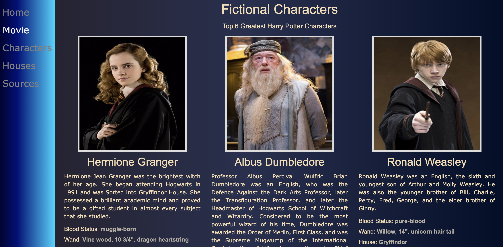

# Harry_Potter_API
Harry Potter Fan Website 

The page has a brief description of the fantastic world of Harry Potter.
with Sidebar menu: Home / Movies / Character / Houses

### Technology
The website was developed in:
HTML Semantic tag
BootStrap Framework version 4.5.2
Jquery version 3.5.1
Javascript

-  Used JSON to get information from the Potter Api for characters and houses, with different routes and the same key.
-  Movies page as well use JSON to get information from OMDb Api where you can sort the movies and check the director, images, plot and rating etc.
- The website has responsive navigation menu bar to fit all size screen.
When the screen is small the menu is load a dropdown, otherwise appear in top of the page.

### Home

### Movies

when click on the movie button seems details of movie

### Characters
Top 6 most famous characters

### Houses
It appears in the right menu the names of the houses to be selected

### Link GitHub
https://adriana-carmo.github.io/Harry_Potter_API/
